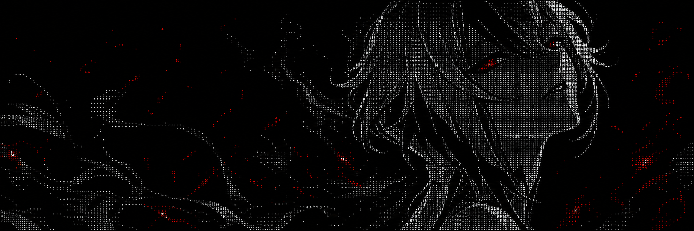
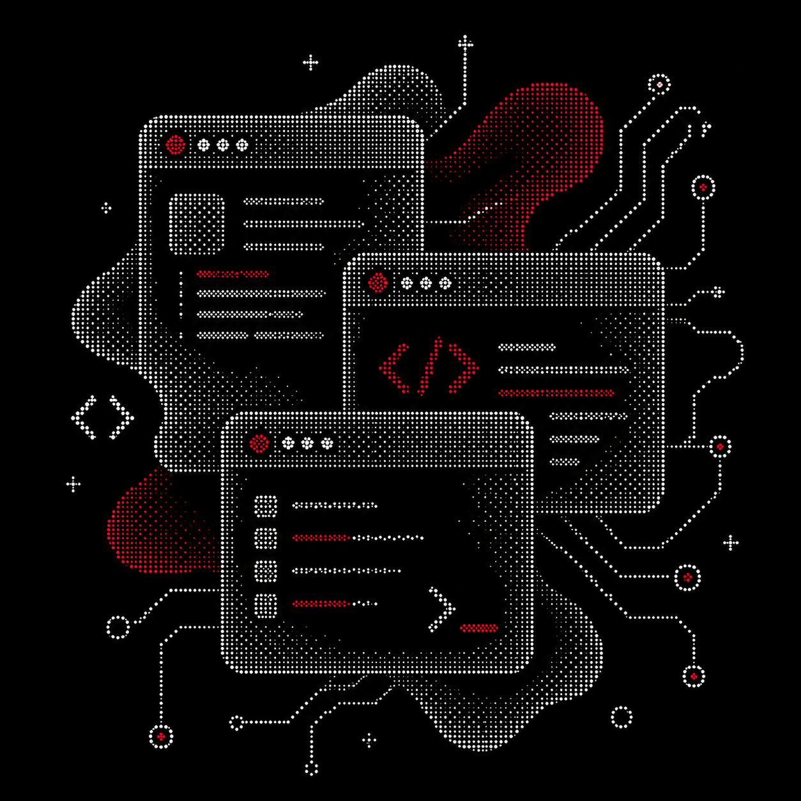

 

### Python Backend Developer · FastAPI · Automation · AI Tools

  
  
  

---

<table>
<tr>
<td width="62%" valign="top">

## Know About Me

Hey there! I'm Vlad.

I'm a backend developer focused on building practical services with Python and FastAPI.

I enjoy working with APIs, databases, automation, AI tools and server-side architecture.  
Right now, I'm improving my backend skills and building real projects instead of endless tutorial apps.

- Backend development with **Python and FastAPI**
- Databases with **PostgreSQL and SQLAlchemy**
- Infrastructure with **Docker, Linux and Git**
- Interested in **AI development, agents and automation**
- Building the **Exillium Minecraft project**
- Working on a platform for launching **Telegram bots for businesses**

</td>
<td width="38%" align="center" valign="middle">

</td>
</tr>
</table>

---

<table>
<tr>
<td width="62%" valign="top">

## Top Projects

### [Nothing](https://github.com/YOUR_USERNAME/EXILLIUM_REPOSITORY)

Nothing

### [TELEGRAM BOT PLATFORM](https://github.com/YOUR_USERNAME/TELEGRAM_BOT_PLATFORM)

A platform that allows businesses to launch and manage Telegram bots without configuring their own servers and databases.

### [FASTAPI BACKEND](https://github.com/YOUR_USERNAME/FASTAPI_REPOSITORY)

Backend project built with FastAPI, PostgreSQL, SQLAlchemy, Alembic, Celery, Pytest and modern Python tooling.

</td>
<td width="38%" align="center" valign="middle">

</td>
</tr>
</table>

---

## Tech Stack

## Tech Stack

  

---

## Connect

  

> Code is never finished. It only becomes slightly less terrible over time.

---

## GitHub Statistics

